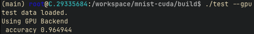

# mnist-cuda

This repository contains an implementation of a neural network trained on the MNIST dataset, written in C++ with optional CUDA GPU acceleration. The goal of the project is to demonstrate how to build and train a neural network from scratch using both CPU and raw CUDA kernels, providing insight into GPU programming and low-level optimization applied to machine learning workloads.

## Motivation

Handwritten digit recognition on the MNIST dataset is a classical task in machine learning, commonly used as a benchmark for neural network training. MNIST consists of 60,000 training images and 10,000 test images of 28x28 grayscale handwritten digits from 0 to 9.

While modern machine learning workflows often rely on high-level frameworks such as PyTorch or TensorFlow, these frameworks abstract away most of the underlying computation. This project was created to understand what happens beneath those abstractions by implementing the entire training pipeline manually.

The goals of this project are to:
- Learn GPU programming fundamentals using raw CUDA kernels
- Implement forward and backward passes explicitly
- Control memory allocation, data transfers, and kernel launches
- Compare CPU and GPU execution on the same neural network

## Technologies Used

- C++ (core implementation)
- CUDA (GPU acceleration)
- CMake (build system)

No high-level deep learning libraries (such as cuDNN, PyTorch, or TensorFlow) are used. The CUDA backend is implemented using custom kernels and low-level CUDA APIs to expose the full execution and memory model.

## Design Overview

The model is a simple fully connected neural network trained using gradient descent and backpropagation. Both CPU and GPU implementations share the same high-level structure, allowing direct comparison between execution backends.

Key design choices include:
- Explicit handling of MNIST IDX file format (big-endian headers)
- Manual implementation of softmax, loss computation, and gradient propagation
- CUDA kernels written for forward pass, backward pass, and gradient accumulation
- Clear separation between CPU and GPU code paths

This design prioritizes clarity and control over maximal performance.

## Training Results

### CPU Training (macOS M2)

Accuracy: **98.21%**  
Training time: **19m 27s**


### GPU Training (NVIDIA RTX 5090)

Accuracy: **97.18%**  
Training time: **1.663s**


## Test Results

### CPU Testing (macOS M2)

Accuracy: **97.06%** on 256 images  
Runtime: very fast


### GPU Testing (NVIDIA RTX 5090)

Accuracy: **96.49%** on 256 images  
Runtime: very fast



Screenshots were captured directly from training and testing runs and are stored in the `data/pics/` directory.

## Building

### Prerequisites

- C++ compiler with C++17 support
- CMake
- CUDA Toolkit (optional, for GPU support)
- NVIDIA GPU (optional)

### Build Instructions

Clone the repository and build:

```bash
git clone https://github.com/aashaykulk/mnist-cuda
cd mnist-cuda
mkdir build
cd build
cmake ..
make
```

The build produces two binaries:
- `train` for training the model
- `test` for evaluating the model

If CUDA is available, the GPU backend can be enabled at runtime.

## Usage

### Training

CPU:
```bash
./train
```

GPU:
```bash
./train --gpu
```

### Testing

CPU:
```bash
./test
```

GPU:
```bash
./test --gpu
```

Test runs are intentionally small and complete very quickly, so wall-clock timing is not reported for testing.

## Repository Structure

```
mnist-cuda/
├── data/
│   └── pics/        Training and testing screenshots
├── models/          Saved model parameters
├── src/             Source code (CPU and CUDA implementations)
├── CMakeLists.txt
├── README.md
└── TODO.md
```

## License

This project is released under the MIT License.
